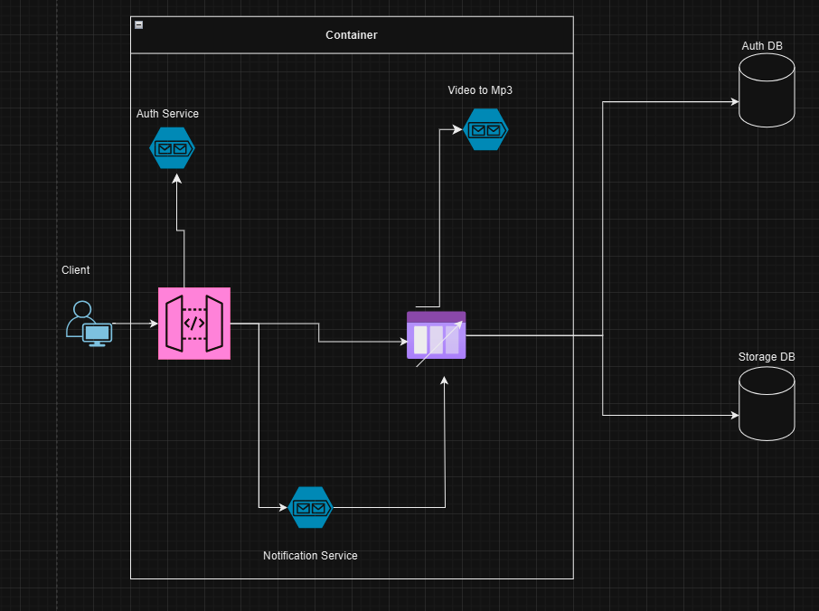

# Video to MP3 Microservices Project

This project is a microservices-based application designed to convert videos to MP3 format. It uses Python for development, is orchestrated with Kubernetes, and integrates multiple services with external databases for a robust, scalable setup.

## Architecture Overview



The architecture consists of four microservices managed by Kubernetes (K8s) and two external databases:

1. **Auth Service** - Handles authentication and authorization for users accessing the services.
2. **Video to MP3 Service** - Converts uploaded video files to MP3 format.
3. **Notification Service** - Sends notifications to users once their video has been converted.
4. **API Gateway** - Serves as the single entry point to route requests to the appropriate services.

Additional components include:
- **RabbitMQ** - Message broker used for asynchronous communication between services.
- **Databases**:
  - **MySQL** - Stores user and authentication data.
  - **MongoDB** - Stores metadata related to videos and MP3 conversions.

## Technologies Used

- **Python** - Core programming language for all services.
- **Kubernetes** - Manages containerized services.
- **RabbitMQ** - Handles asynchronous messaging between microservices.
- **MySQL** - Relational database for authentication and user data.
- **MongoDB** - NoSQL database for storing video and conversion data.

## Services

### 1. Auth Service
   - Manages user authentication and authorization.
   - Communicates with MySQL to store and retrieve user credentials.

### 2. Video to MP3 Service
   - Receives video files, processes them, and converts them to MP3.
   - Uses RabbitMQ to communicate with the Notification Service for status updates.

### 3. Notification Service
   - Sends notifications (such as email or push notifications) after a video has been successfully converted.
   - Listens to messages from RabbitMQ to trigger notifications.

### 4. API Gateway
   - Acts as a single entry point for external clients.
   - Routes requests to the appropriate internal services based on the API endpoints.

## Databases

- **MySQL** - Stores user-related data, including login and session information for the Auth Service.
- **MongoDB** - Stores metadata about video files, conversion statuses, and any other data related to the Video to MP3 service.

## Installation and Setup

1. **Clone the Repository**
   ```bash
   git clone https://github.com/tarun-kavipurapu/Video-Mp3.git
   cd video-to-mp3-microservices
   ```

2. **Setup Databases**
   - Ensure MySQL and MongoDB are running and accessible outside the Kubernetes cluster.
   - Create required schemas and tables for both databases.

3. **Deploy with Kubernetes**
   - Configure your Kubernetes environment and ensure RabbitMQ is deployed.
   - Deploy each service with the following command:
     ```bash
     kubectl apply -f k8s/<service-name>.yaml
     ```
   - Expose the API Gateway for external access.

4. **Environment Variables**
   - Each service requires environment variables for database connections and RabbitMQ. Configure these in each service’s `config` file or directly in the Kubernetes manifest files.

5. **Start Services**
   - Use Kubernetes to manage the lifecycle of each service.
   - Access the application through the API Gateway endpoint.
